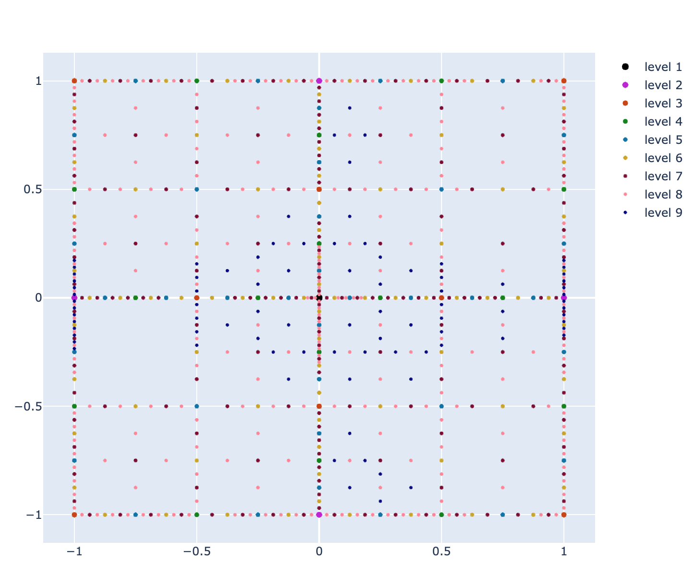
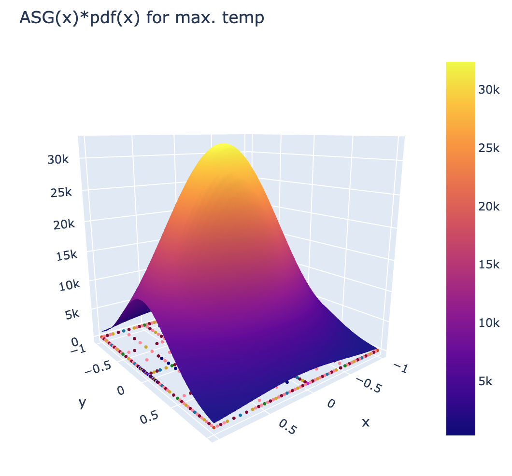
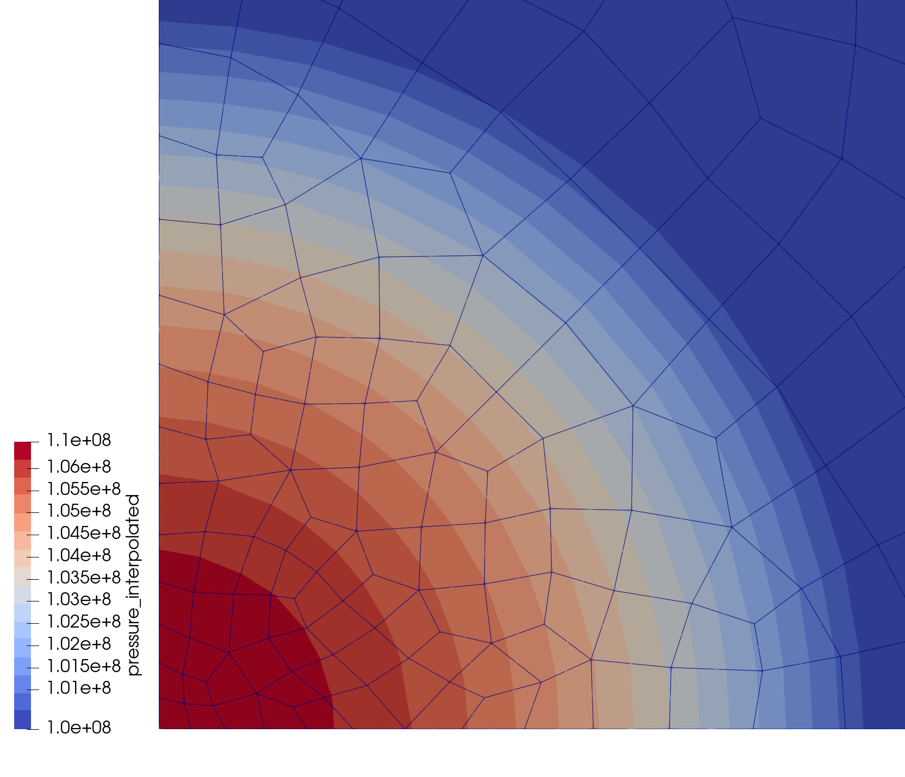
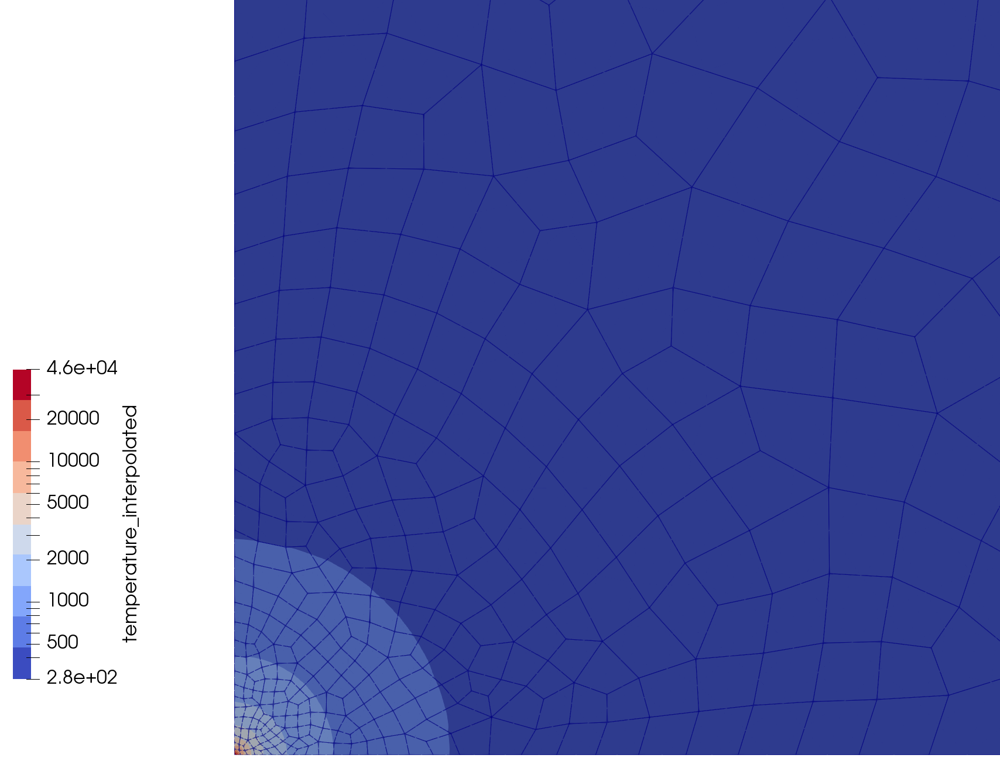
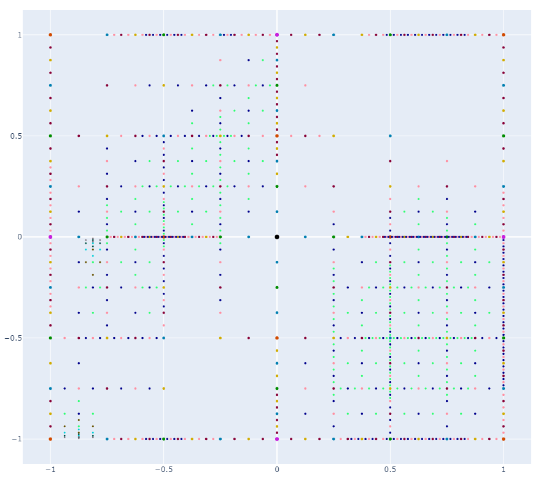
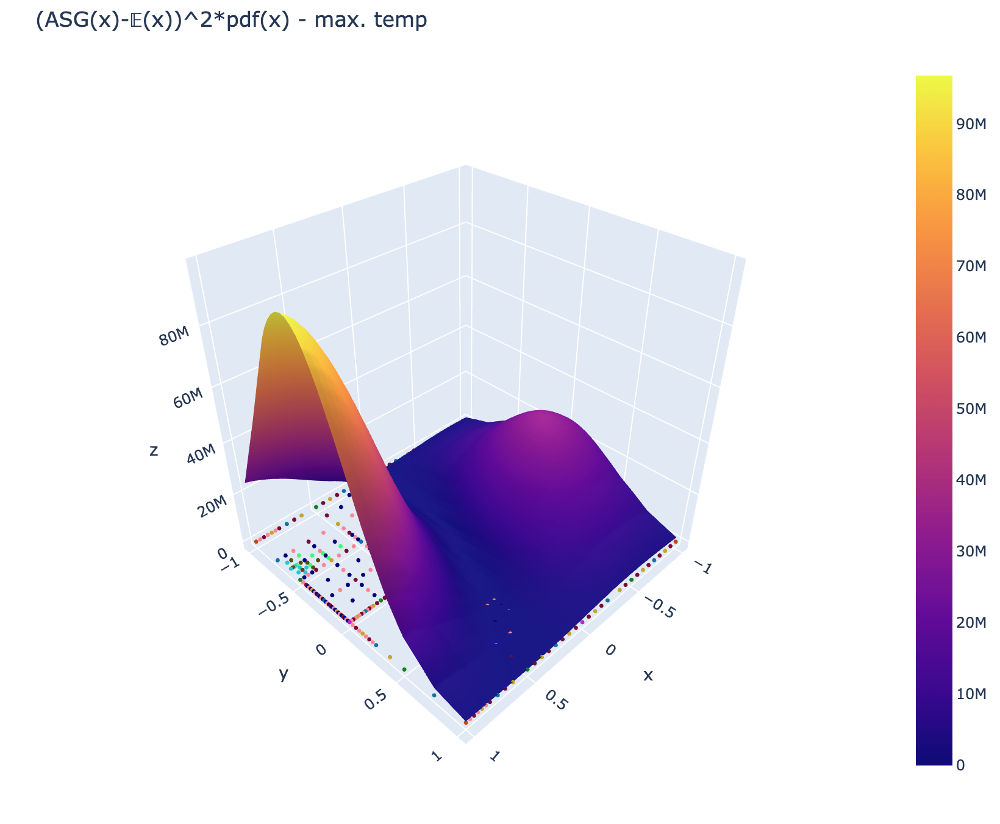
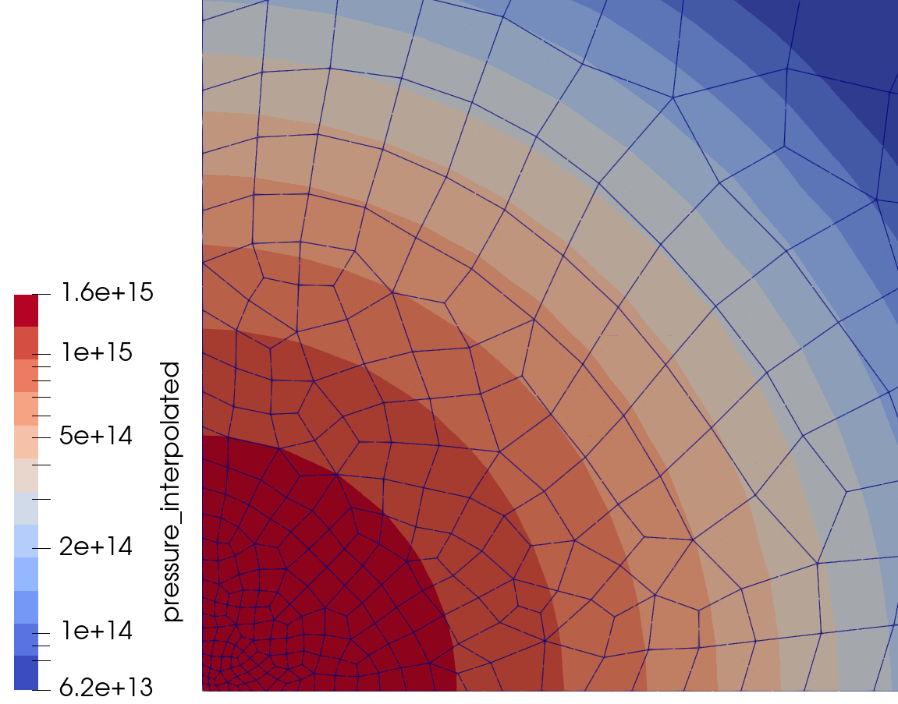
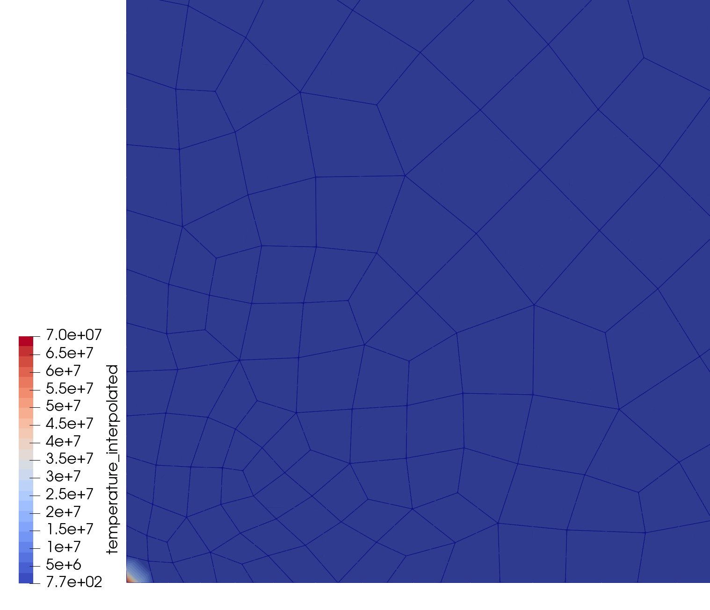

# OpenGeoSysUncertaintyQuantification.jl

## Contents

```@contents
Pages = ["index.md"]
Depth = 5
```

## Install OpenGeoSys 6 (Linux only)

A generic OGS6 binary can be installed to the `test` folder via:

```julia
import OpenGeoSysUncertaintyQuantification.install_ogs
OGS_PATH = install_ogs()
```

Note that a python with version < 3.12 has to be installed for this work. This function is called by unit testing.
This was only tested with Linux and probably does not work with Windows. However, you can take the install script [install_ogs.sh](https://github.com/baxmittens/OpenGeoSysUncertaintyQuantification.jl/blob/main/test/install_ogs.sh) as an example for installing OpenGeoSys on Windows. For more information about the installation of OGS6, see [the OGS6 documentation](https://www.opengeosys.org/docs/).

## The principle idea for the creation of a stochastic OGS6 project

The principle idea is to always start with a fully configured and running deterministic OGS6 project. There are three basic functions which create three individual xml-files which are used to define the stochastic OGS project. These files are human-readable and can be manually configured and duplicated for the use in other, or slightly altered, stochastic projects.

Note that if relative pathes are used as in this documentation, the scripts have always be called from the same directory. You can prevent this by using absolute pathes.

The first function 
```julia
generatePossibleStochasticParameters(
	projectfile::String, 
	file::String="./PossibleStochasticParameters.xml", 
	keywords::Vector{String}=ogs_numeric_keyvals
)
```
scans an existing `projectfile` for all parameters which can be used in a stochastic project. What is considered to be a possible stochastic parameter is defined by the [`keywords`](https://github.com/baxmittens/OpenGeoSysUncertaintyQuantification.jl/blob/main/src/OpenGeoSysUncertaintyQuantification/utils.jl#L2). By this, an xml-file `file` is generated where all possible stochastic parameters are listed. 

The second function

```julia
generateStochasticOGSModell(
	projectfile::String,
	simcall::String,
	additionalprojecfilespath::String,
	postprocfile::Vector{String},
	stochpathes::Vector{String},
	outputpath="./Res",
	stochmethod=AdaptiveHierarchicalSparseGrid,
	n_local_workers=50,
	keywords=ogs_numeric_keyvals,
	sogsfile="StochasticOGSModelParams.xml"
	)
```
creates an xml-file which defines the so-called `StochasticOGSModelParams`. It is defined by 
- the location to the existing `projectfile`, 
- the `simcall` (e.g. `"path/to/ogs/bin/ogs"`), 
- a `additionalprojecfilespath` where meshes and other files can be located which are copied in each individual folder for a OGS6-snapshot, 
- the path to one or more `postprocfile`s, 
- the stochpathes, generated with `generatePossibleStochasticParameters`. Can be manipulated by the user and loaded by the `loadStochasticParameters`-function,
- an `outputpath`, where all snapshots will be stored,
- a `stochmethod` (Sparse grid or Monte-Carlo, see [Library](https://baxmittens.github.io/OpenGeoSysUncertaintyQuantification.jl/dev/lib/lib/)),
- the number of local workers `n_local_workers`, and, 
- the filename `sogsfile` under which the model is stored as an xml-file. 

This function also creates a file [`user_function.jl`](https://github.com/baxmittens/OpenGeoSysUncertaintyQuantification.jl/blob/main/src/OpenGeoSysUncertaintyQuantification/user_function_template.jl) if not already available, which is loaded by all workers and serves as an interface between OGS6 and Julia. Here it is defined how the individual snaptshots are generated and how the postprocessing results are handled.

The third and last function

```julia
generateSampleMethodModel(
	sogsfile::String, 
	anafile="SampleMethodParams.xml"
	)
# or
generateSampleMethodModel(
	sogs::StochasticOGSModelParams, 
	anafile="SampleMethodParams.xml"
	)
```
creates an xml-file `anafile` with all necessary parameters for the chosen sample method in the `StochasticOGSModelParams`.

## Usage

In this chapter, [ASG_Point_Heat_Source](https://github.com/baxmittens/OpenGeoSysUncertaintyQuantification.jl/tree/main/test/Examples/ASG_Point_Heat_Source) is used to illustrate the workflow. The underlying deterministic OGS6 project is the [point heat source example](https://www.opengeosys.org/docs/benchmarks/th2m/saturatedpointheatsource/) ([Thermo-Richards-Mechanics project files](https://gitlab.opengeosys.org/ogs/ogs/-/tree/master/Tests/Data/ThermoRichardsMechanics/PointHeatSource)).

The complete example can be run by directing to the path `path/to/OpenGeoSysUncertaintyQuantification/test/ex1`, running Julia (if Julia is started by, e.g., `julia -t 10`, the adaptive sparse grid can take advantage of the extra threads) and starting the example by
```julia
include("run_ex1.jl")
``` 

### Defining the stochastic dimensions

The following [lines of code](https://github.com/baxmittens/OpenGeoSysUncertaintyQuantification.jl/blob/main/test/Examples/ASG_Point_Heat_Source/generate_stoch_params_file.jl) 
```julia
using OpenGeoSysUncertaintyQuantification

projectfile="./project/point_heat_source_2D.prj"
pathes = generatePossibleStochasticParameters(projectfile)

porosity_ind = findfirst(x->contains(x,"@id/0") && contains(x,"porosity"), pathes)
liquid_th_cond_ind = findfirst(x->contains(x,"@id/0") && contains(x,"AqueousLiquid") && contains(x,"thermal_conductivity"), pathes)

writeStochasticParameters(pathes[[porosity_ind, liquid_th_cond_ind]], "./StochasticParameters.xml")
```
generate the stochastic parameters as [`OGS6-XML-pathes`](https://github.com/baxmittens/Ogs6InputFileHandler.jl/blob/63944f2bcc54238af568f5f892677925ba171d5a/src/Ogs6InputFileHandler/utils.jl#L51). These are then written to a XML file `PossibleStochasticParameters.xml` in the working directory

```xml
<?xml version="1.0" encoding="UTF-8"?>
<Array
	 julia:type="String,1"
>
	./media/medium/@id/0/properties/property/?porosity/value
	./media/medium/@id/0/phases/phase/?AqueousLiquid/properties/property/?thermal_conductivity/value
</Array>
```

### Defining the stochastic model

The following [code snippet](https://github.com/baxmittens/OpenGeoSysUncertaintyQuantification.jl/blob/main/test/Examples/ASG_Point_Heat_Source/generate_stoch_model.jl) 
```julia
using OpenGeoSysUncertaintyQuantification

projectfile="./project/point_heat_source_2D.prj"
simcall="ogs" # ogs binary has to be in path. otherwise insert your "path/to/ogs"
additionalprojecfilespath="./mesh"
outputpath="./Res"
postprocfiles=["PointHeatSource_quarter_002_2nd.xdmf"]
outputpath="./Res"
stochmethod=AdaptiveHierarchicalSparseGrid
n_workers = 10

stochparampathes = loadStochasticParameters("StochasticParameters.xml")
	
stochasticmodelparams = generateStochasticOGSModell(
	projectfile,
	simcall,
	additionalprojecfilespath,
	postprocfiles,
	stochparampathes,
	outputpath,
	stochmethod,
	n_workers)

# alter the stochastic parameters
stoch_params = stoch_parameters(stochasticmodelparams)
@assert contains(stoch_params[1].path, "AqueousLiquid")
stoch_params[1].dist = Normal(0.6,0.175)
stoch_params[1].lower_bound = 0.3
stoch_params[1].upper_bound = 0.9
stoch_params[2].dist = Normal(0.45,0.15)
stoch_params[2].lower_bound = 0.1
stoch_params[2].upper_bound = 0.8

write(stochasticmodelparams)

samplemethodparams = generateSampleMethodModel(stochasticmodelparams)

#alter sample method params
samplemethodparams.RT = XDMF3File #according to `fun` user_functions.jl
samplemethodparams.init_lvl = 4
samplemethodparams.maxlvl = 12
samplemethodparams.tol = 0.025

write(samplemethodparams)
```

generates two XML-files, `StochasticOGSModelParams.xml` and `SampleMethodParams.xml`, defining the stochastic model.

In the former, the two stochastic parameters are altered. The probability distributions are altered from `Uniform` to `Normal` with mean `μ=0.45` and standard deviation `σ=0.15` for the porosity and to `Normal` with mean `μ=0.6` and standard deviation `σ=0.175` for the thermal conductivity.

Note that for efficiency, the normal distribution is changed to a [truncated normal distribution](https://en.wikipedia.org/wiki/Truncated_normal_distribution) by setting the parameters `lower_bound=0.1` and `upper_bound=0.8` for the porosity and `lower_bound=0.3` and `upper_bound=0.9` for the thermal conductivity. This results in an integration error of approximately 2.5% for this example. See the picture below for a visualization of the normal distribution $\mathcal{N}$ and the truncated normal distribution $\bar{\mathcal{N}}$.

```@raw html
<p align="center">
	
</p>
```

The multivariate truncated normal distribution resulting from the convolution of both one-dimensional distributions is pictured below. Note, that the distribution has been transformed to the domain $[-1,1]^2$ of the [sparse grid](https://github.com/baxmittens/DistributedSparseGrids.jl).

```@raw html
<p align="center">
	
</p>
```

The second file `SampleMethodParams.xml` defines the sample method parameters such as
- the number of dimensions `N=2`,
- the return type `RT="XDMF3File"` (see [XDMFFileHandler.jl](https://github.com/baxmittens/XDMFFileHandler.jl))
- the number of initial hierachical level of the sparse grid `init_lvl=4`,
- the number of maximal hierarchical level of the sparse grid `maxlvl=12`, and,
- the minimum hierarchical surplus for the adaptive refinement `tol=0.025`.

### Sampling the model

The following [lines of code](https://github.com/baxmittens/OpenGeoSysUncertaintyQuantification.jl/blob/main/test/ex1/start.jl)

```julia
using OpenGeoSysUncertaintyQuantification
ogsuqparams = OGSUQParams("StochasticOGSModelParams.xml", "SampleMethodParams.xml")
ogsuqasg = init(ogsuqparams)
start!(ogsuqasg)
```

load the parameters `ogsuqparams`, initializes the model `ogsuqasg`, and, starts the sampling procedure. Finally the expected value is integrated. Note that since the pathes are relative, the `start!` function has to be called from the working directory.

* Initializing the model `OpenGeoSysUncertaintyQuantification.init(ogsuqparams)` consists of two steps
	
    1. Adding all local workers (in this case 10 local workers)
    2. Initializing the adaptive sparse grid.

* Starting the sampling procedure `OpenGeoSysUncertaintyQuantification.start!(ogsuqasg)` first creates 4 initial hierarchical levels levels and, subsequently, starts the adaptive refinement. This first stage results in an so-called *surrogate model* of the physical domain defined by the boundaries of the stochastic parameters

```@raw html
<table border="0"><tr>
<td> 
	<figure>
		<br>
		<figcaption><em>resulting sparse grid</em></figcaption>
	</figure>
</td>
<td> 
	<figure>
		<br>
		<figcaption><em>response surface</em></figcaption>
	</figure>
</td>
</tr></table>
```

### Computation of the expected value

The expected value of an stochastic OGS project can be computed by:
```julia
expval,asg_expval = 𝔼(ogsuqasg)
write(expval, "expval.xdmf", "expval.h5")
```

Hereby, the physical surrogate model, generated by the sampling of the model, is weighted against the pdf of each stochastic dimension. The resulting sparse grid and the response function (by showing the the maximal temperature in the domain per collocation point) can be seen below.
```@raw html
<table border="0"><tr>
<td> 
	<figure>
		<br>
		<figcaption><em>resulting sparse grid</em></figcaption>
	</figure>
</td>
<td> 
	<figure>
		<br>
		<figcaption><em>response surface</em></figcaption>
	</figure>
</td>
</tr></table>
```

By integrating over the stochstic domain, the expected value is computed. Below the pressure field and the temperature field are shown.
```@raw html
<table border="0"><tr>
<td> 
	<figure>
		<br>
		<figcaption><em>expected value: pressure field</em></figcaption>
	</figure>
</td>
<td> 
	<figure>
		<br>
		<figcaption><em>expected value: temperature field</em></figcaption>
	</figure>
</td>
</tr></table>
```

### Computation of the variance

The variance can be computed by:

```julia
varval,asg_varval = variance(ogsuqasg, expval)
write(varval, "varval.xdmf", "varval.h5")
```

Again, the physical surrogate is used to compute the variance on another sparse grid. Below the resulting sparse grid and the response function is displayed. Note that despite the complexity of the response function, it is captured efficiently by the adaptive sparse grid collocation method.
```@raw html
<table border="0"><tr>
<td> 
	<figure>
		<br>
		<figcaption><em>resulting sparse grid</em></figcaption>
	</figure>
</td>
<td> 
	<figure>
		<br>
		<figcaption><em>response surface</em></figcaption>
	</figure>
</td>
</tr></table>
```

As above, the variance can be computed by integrating over the stochastic domain. Below the variance of the pressure field and temperature field is displayed. 
```@raw html
<table border="0"><tr>
<td> 
	<figure>
		<br>
		<figcaption><em>variance: pressure field</em></figcaption>
	</figure>
</td>
<td> 
	<figure>
		<br>
		<figcaption><em>variance: temperature field</em></figcaption>
	</figure>
</td>
</tr></table>
```

## Important to note

- According to the implemented behavior in the projects `user_function.jl`, the simcall is not executed if a postprocessing result is to be found in the directory `./Res/ID/`. The user must ensure that the data in this folder is compatible with the definitions of the stochastic project. This means that the result folder must be deleted manually if the lower or upper bound of a parameter has changed (but not if only the distribution has changed).

## Contributions, report bugs and support

Contributions to or questions about this project are welcome. Feel free to create a issue or a pull request on [GitHub](https://github.com/baxmittens/OpenGeoSysUncertaintyQuantification.jl).